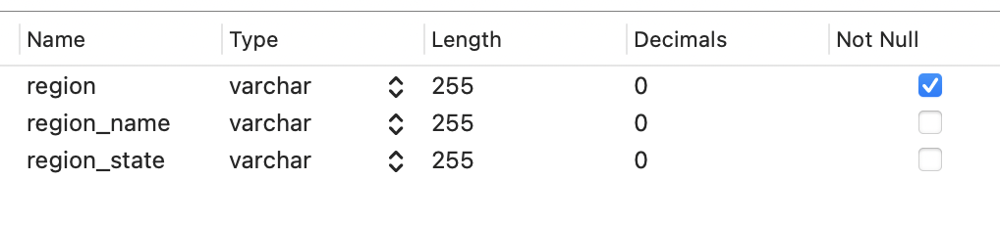
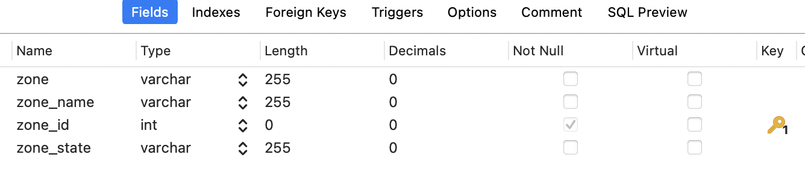
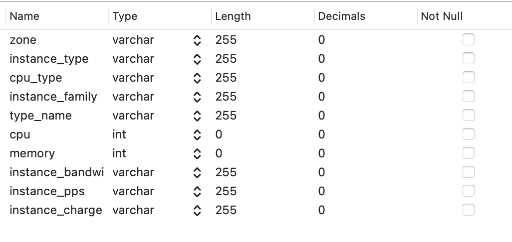
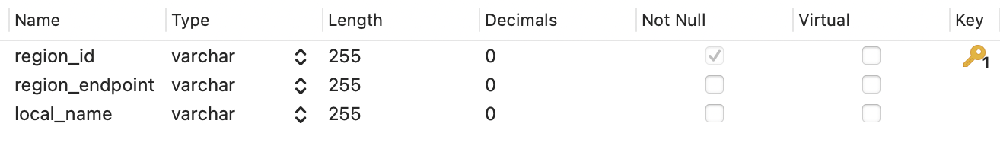
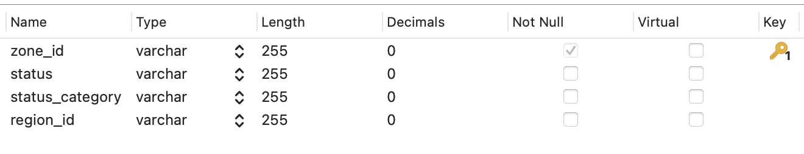
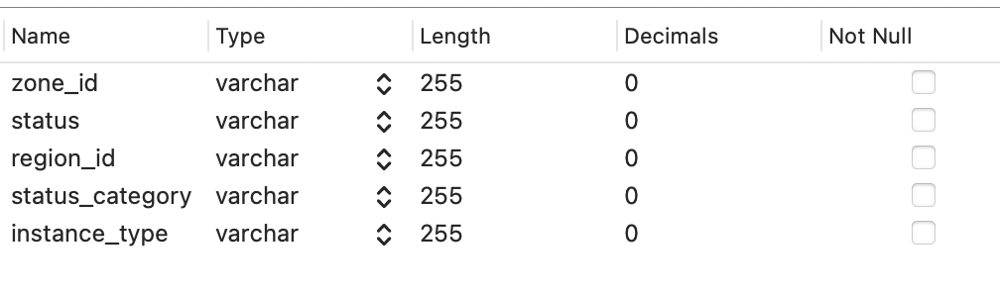
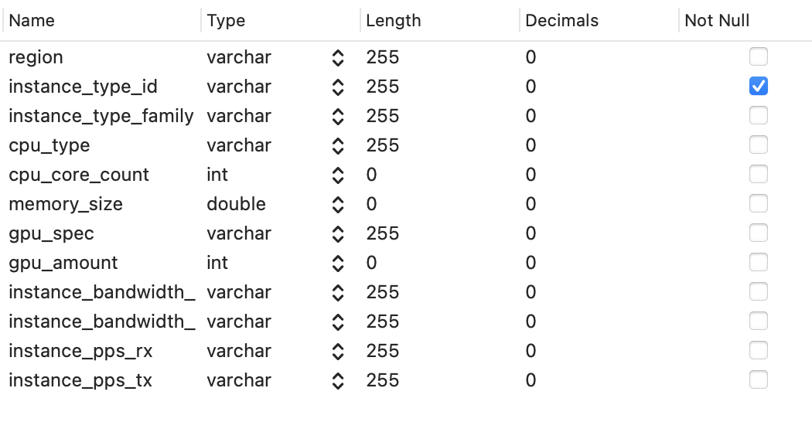
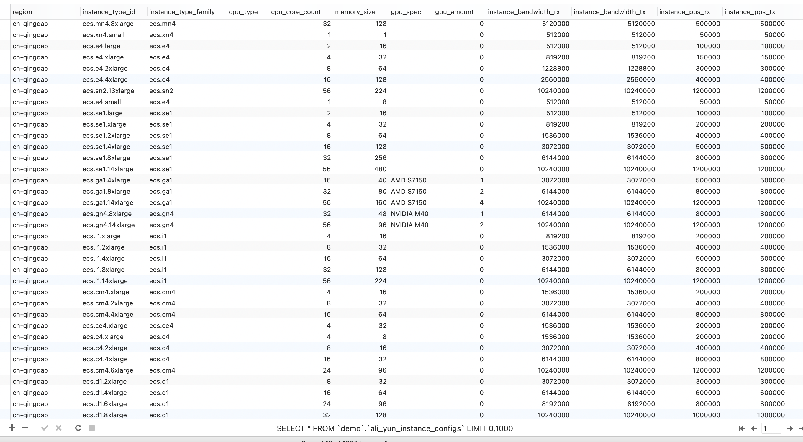

# 项目说明

### **项目介绍：**

​		本项目为多云厂商相关数据自动化定时获取项目，基于SpringBoot + Mybatis-Plus实现，数据包括腾讯云与阿里云的可用地域、可用区和机型实例的配置信息。

### **开发工具：**

 - IntelliJ IDEA 2022.1.4
 - Navicat for MySQL 12.1.19

### **开发环境：**

 - JDK 1.8
 - Maven 3.8.1
 - Spring-Boot 2.7.3
 - Mybatis-Plus 3.4.2
 - MySQL 8.0.29

# 运行说明

 - 下载项目，把demo.sql导入本地数据库

 - 导入相关依赖的maven坐标

 - 配置数据源和云厂商密钥

   - 在`application.yml`配置本地mysql数据库的***username***和***password***
   - 配置腾讯云账户的***secretId***（对应*tencentId*）和***secretKey***（对应*tencentKey*)），配置阿里云账户的***AccessKeyId***（对应*aliYunAccessKeyId*）和***AccessKeySecret***（对应*aliYunAccessKeySecret*）

 - 启动项目`DemoApplication`

   #### 相关依赖的maven坐标如下

   ```java
   <dependencies>
           <dependency>
               <groupId>org.springframework.boot</groupId>
               <artifactId>spring-boot-starter</artifactId>
           </dependency>
   
           <dependency>
               <groupId>com.baomidou</groupId>
               <artifactId>mybatis-plus-boot-starter</artifactId>
               <version>3.4.2</version>
           </dependency>
   
           <dependency>
               <groupId>mysql</groupId>
               <artifactId>mysql-connector-java</artifactId>
               <scope>runtime</scope>
           </dependency>
   
           <dependency>
               <groupId>com.alibaba</groupId>
               <artifactId>druid</artifactId>
               <version>1.1.22</version>
           </dependency>
   
           <dependency>
               <groupId>com.alibaba</groupId>
               <artifactId>fastjson</artifactId>
               <version>1.2.76</version>
           </dependency>
   
   
           <dependency>
               <groupId>org.apache.velocity</groupId>
               <artifactId>velocity-engine-core</artifactId>
               <version>2.3</version>
           </dependency>
   
           <dependency>
               <groupId>org.projectlombok</groupId>
               <artifactId>lombok</artifactId>
           </dependency>
   
           <dependency>
               <groupId>com.tencentcloudapi</groupId>
               <artifactId>tencentcloud-sdk-java</artifactId>
               <!-- go to https://search.maven.org/search?q=tencentcloud-sdk-java and get the latest version. -->
               <!-- 请到https://search.maven.org/search?q=tencentcloud-sdk-java查询所有版本，最新版本如下 -->
               <version>3.1.551</version>
           </dependency>
   
   
           <dependency>
               <groupId>com.aliyun</groupId>
               <artifactId>alibabacloud-ecs20140526</artifactId>
               <version>4.24.17</version>
           </dependency>
   
           <dependency>
               <groupId>com.aliyun</groupId>
               <artifactId>tea-openapi</artifactId>
               <version>0.2.5</version>
           </dependency>
   
           <dependency>
               <groupId>org.springframework.boot</groupId>
               <artifactId>spring-boot-configuration-processor</artifactId>
               <optional>true</optional>
           </dependency>
   
       </dependencies>
   ```

   

# 代码说明

### 目录结构

 - dao层——包含mapper接口，继承BaseMapper，实现service层的前置
 - entity层——对应数据库中表的实体类
 - service层——包含各service接口和实现类：集成了Mybatis-plus的封装类，封装了一些常用的增删改查方法
 - utils层——包含解析JSON数据、抽取业务所需核心参数的工具类，多云厂商初始化client工具类，以及项目初始化运行加载工具类

### 核心代码说明

#### 1、核心参数的抽取

​	utils包下的toSql文件夹下的各个类的功能为调用多云厂商API，从返回的数据中抽取业务所需的核心参数，其中最重要的是核心参数的抽取。

​	此处引入fastjson依赖，用来在json和Java对象之间的转换，对多云厂商API接口返回的数据进行筛选，抽取。

​	涉及JSONObject，String，JSONArray的转换。

​	后续如需添加其他参数，可进行更改。

​	**代码示例：**

```java
						// 将API返回的数据转换成JSONObjct
						String jsonString = JSON.toJSONString(DescribeAvailableResourceResponse.toMap(resp));
            JSONObject jsonObject = JSONObject.parseObject(jsonString);
						// 获取body字段的JSONObject
            JSONObject bodyObject = JSONObject.parseObject(jsonObject.getString("body"));
            JSONObject regionsObject = JSONObject.parseObject(bodyObject.getString("AvailableZones"));
						// 获取AvailableZone字段的JSONArray
            JSONArray zoneInfo = regionsObject.getJSONArray("AvailableZone");
            for (Object o : zoneInfo) {
              // 将JSONArray转换为JSONObject并抽取核心参数
                JSONObject key = (JSONObject) o;
                String zoneId = key.getString("ZoneId");
                String status = key.getString("Status");
                String regionId = key.getString("RegionId");
                String statusCategory = key.getString("StatusCategory");
              	// 内部嵌套了需要的提取核心的JSONArray
                JSONObject avaReJson = JSONObject.parseObject(key.getString("AvailableResources"));
                JSONArray avaReJsonArray = avaReJson.getJSONArray("AvailableResource");
              	// 使用for循环抽取该JSONArray的核心参数
                for (Object value : avaReJsonArray) {
                    JSONObject key1 = (JSONObject) value;
                    JSONObject supportedResources = JSONObject.parseObject(key1.getString("SupportedResources"));
                    JSONArray instanceInfoArray = supportedResources.getJSONArray("SupportedResource");
                    for (Object item : instanceInfoArray) {
                        JSONObject key2 = (JSONObject) item;
                        String instanceType = key2.getString("Value");
                        AliYunInstances aliYunInstances = new AliYunInstances(zoneId, status, regionId, statusCategory, instanceType);
                        result.add(aliYunInstances);
                    }
                }
            }
```

#### 2、定时任务的开启

| **实现定时任务的三种方式** | **优缺点分析**                                               |
| -------------------------- | ------------------------------------------------------------ |
| Timer                      | 使用简单，当添加并执行多个任务时，前面任务的执行用时和异常将影响到后面任务，谨慎使用 |
| ScheduledExecutorService   | 使用简单，解决了Timer类存在的问题，仅适用于单机环境          |
| Spring Task                | 以上两种方式都很难实现某些特定需求，比如每周一执行某任务，但SpringTask可以轻松实现 ，并且Spring也是可以轻松实现异步多线程的 |

经过优缺点比较，最终选择**Spring Task**的实现定时任务的方式。

**实现方法**：

​	在启动类上加上**@EnableScheduling**注解

​	在`FetchData`类的updateData()方法上增加**@Scheduled**注解，注解内的fixedRate参数决定定时周期，可以根据需要修改，此处默认为每五分钟更新一次数据。也可以使用cron表达式来定义更为复杂的定时规则。

​	在使用fixedRate时可能出现的问题是会被阻塞

​	解决方式：加上注解**@EnableAsync**（类上）和**@Async**（方法上），加了注解以后，就开启了多线程模式，当到了下一次任务的执行时机时，如果上一次任务还没执行完，就会自动创建一个新的线程来执行它。异步执行也可以理解为保证了任务以固定速度执行。

#### 3、重复代码和全局常量的抽取

​	utils包下的GetCloudHttpConnect类的方法包括返回腾讯云和API连接时所需的Credential、ClientProfile，返回阿里云和API连接时所需的StaticCredentialProvider，返回两个云厂商的regions数组。

​	腾讯云每次在跟连接API获取数据时，都会先建立一个client，建立client需要一个Credential、ClientProfile.

​	阿里云每次在跟连接API获取数据时，都会先建立一个StaticCredentialProvider的provider

​	两个云厂商在获取instance数据和zones数据时都需要先获取regions数据。

​	这三种行为都会导致代码的重复，于是将它们抽取出来构建了utils包下的GetCloudHttpConnect类。

​	腾讯云账户的***secretId***和***secretKey***，阿里云账户的***AccessKeyId***和***AccessKeySecret***作为全局变量，直接在application.yml中配置，再在GetCloudHttpConnect类上加入@ConfigurationProperties(prefix = "application.yml")，类中加入@Value进行调用。方便修改的同时又保证了个人账户的安全。

#### 4、MyBatis-Plus对数据表的更新与存储

```java
				List<TencentRegions> regions = getRegionsData();
        tencentRegionsService.remove(null);
        tencentRegionsService.saveBatch(regions);
        log.info("******成功保存Tencent Regions数据******");
```

如上代码所示：调用tencentRegionsService接口的remove方法对表中历史数据进行清空;

​							调用saveBatch方法将获取的TencentRegions的数组存入数据表中。

# 数据表说明

一共涉及如下7张表：

##### 1. tencent_regions

​	该表记录了腾讯云的所有可用地域



##### 2. tencent_zones

​	该表记录了腾讯云的所有可用区



##### 3. tencent_instance_configs

​	该表记录了腾讯云的所有在售实例的相关配置信息



##### 4. ali_yun_regions

​	该表记录了阿里云的所有可用地域



##### 5. ali_yun_zones

​	该表记录了阿里云的所有可用区



##### 6. ali_yun_instances

​	该表记录了阿里云可用区所有售卖实例



##### 7. ali_yun_instance_configs

​	该表记录了阿里云的所有在售实例的相关配置信息



##### 数据存储效果展示

以阿里云在售实例配置信息表为例：



【说明】

 - 数据库表的设计可能不尽规范，相关数据为直接存储，且表之间并无太多关联。
 - 多云厂商的配置信息的参数只选取了部分，后因业务需要可进行更改。

# 其他说明

 - 暂未遇到接口流量限制的问题

 - 数据的处理，如核心参数的抽取，数据的存储是否有更好的方式，期待一个更好的解决方案

 - 询价接口的调用方式复杂，返回的数据难处理，价格如何更为方便地获取同样期待更好的解决方案

   

## 作者信息

王沛然 邮箱：pxwatson@foxmail.com